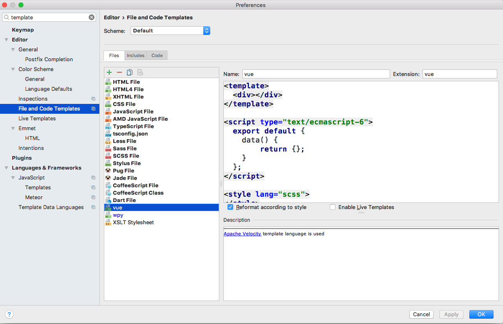
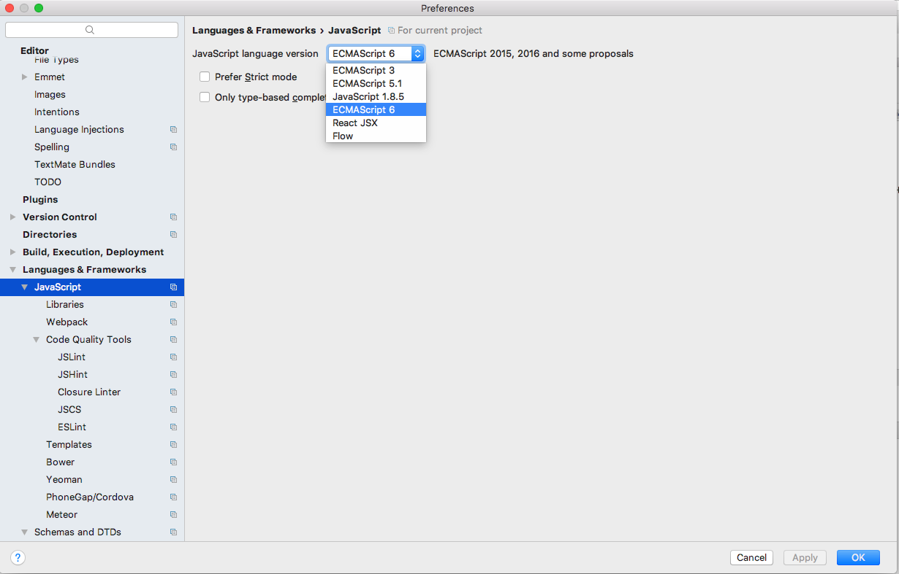
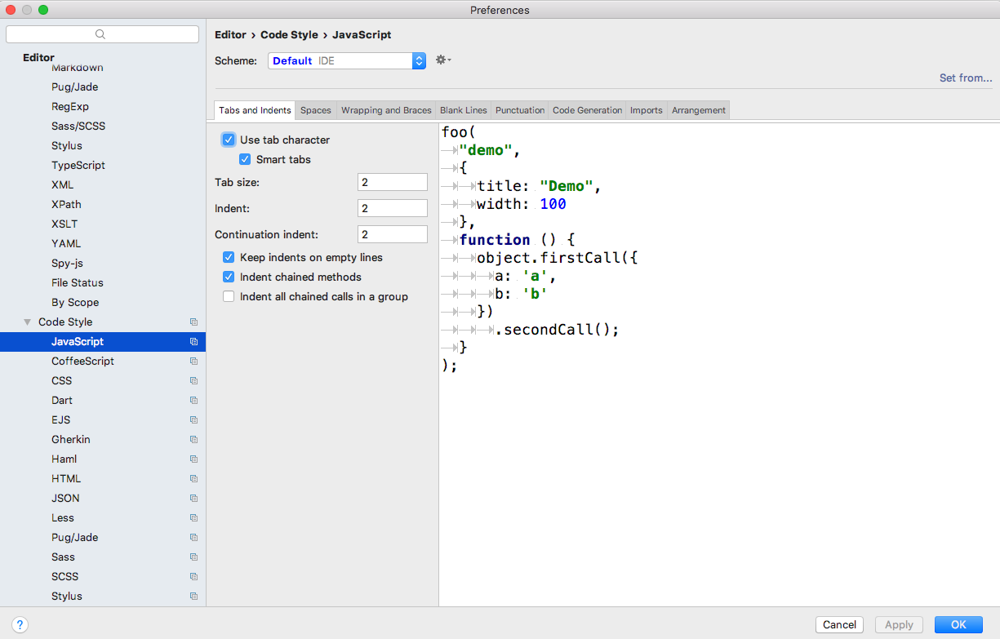

# 前端技术规范

* 前端 javascript 的编写规范
* 前端 css 的编写规范

## 工具

#### webstorm
* 设置vue文件   
    * 
* 设置es6语法格式
    *     
* 设置缩进
    *       
#### sublime
* 略
    
   
## javascript 规范

#### 缩进规范：
* 通过工具统一缩进2个空格

## 
 
#### 声明规范：
 
* 变量名驼峰命名 
    ```
    let myName = "";
    ```
* 常量名大写
    ``` 
    const PI = Math.PI;
    ``` 
* 私有变量名 
    ```
    let _self = this;
    ```
* 表达式结尾分号保留(建议保留)
    ```
    let str = "Hello World";
    ```
* 字符串声明使用双引号(单引号也可以,具体看项目组统一决定)
    ```
    let str = "Hello World";
    ```
* 类名首字母大写 
    ```
    class Child extends Parent;
    ```
* 语义化声明
    ```
    布局
    wrapper, main, content, header, footer, sidebar, nav, subNav,
    ```
    ```
    结构
    section, article, panel, figure
    ```
    ```
    功能
    logo, banner, tag, message, tips, vote, friendlink, summary, search, tools, mask
    ```
    
## 

#### 编写规范：   
* 空格控制
    ```
    let name = "Edward";
    if (name) {
      console.log("true");
    } else {
      console.log("false"); 
    }
    ```
    ```
    let story = [
      1,
      2,
      3
    ];
    let arr = [1, 2, 3, 4, 5];
    for (let key in arr) {
      console.log(arr[key]);
    }
    ```
    
    ```
    let foo1 = function () {};
    let foo2 = function a() {};
    ```
    
    ```
    // bad
    function foo(bar, baz, quux) {
      ...
    }
    function foo(bar,
                 baz,
                 quux) {
      ...                 
    } 
    // good 
    function foo(
      bar,
      baz, 
      quux
    ) {
      ...
    }  
    
    ```
* 对象属性省略    
    ```
    let name = "Edward";
    let age = 18;
    let obj = {
      name,
      age,
      getName() {
        console.log(this.name);
      }    
    }
    ```
    
* 箭头函数
    ```
    let cb = () => "train";
    ```

* 模板
    ```
    let tmpStr = "Hello world";
    let tmp = `this is ${tmpStr}`;
    ```       
        
#### 技巧简介：     
* rest用法
    ```
    //bad:
    let original = {a: 1, b: 2};
    let copy = Object.assign(original, {c: 3});
    //good: 
    let original = { a: 1, b: 2 };
    let copy = { ...original, c: 3 };
    ```    

    ```
    let obj1 = {
       name: "Edward",
       age: 18
    }
    let obj2 = {
       name: "elric",
       age: 17 
    }
    let copy = [{...obj1}, {...obj2}];
    ```    
    
    ```
    let dom = document.querySelectorAll("div");
    // good 
    let doms = Array.from(dom);
    // best
    let doms = [...dom];
    ```
* 解构
    ```
    // bad
    function getName(user) {
      let firstName = user.firstName;
      let lastName = user.lastName;    
    }
    // good
    function getName(user) {
      let {firstName, lastName} = user;
    }
    // best
    function getName({firstName, lastName}) {
      console.log(firstName, lastName);  
    }
    ```
    ```
    let arr = [1, 2, 3, 4];
    // bad
    let first = arr[0];
    let second = arr[1];
    // good
    let [first, second] = arr;
    ```
    
* 函数声明
    ```
    // bad 
    function foo() {
    
    }
    let foo = function() {
    
    }
    // good
    let foo = function foo() {
    
    }
    ```

* 快速与、快速或
    ```
    let origin;
    let cur = origin || 2;
    let cur = origin && 2;
    ```    
          
* 表达式
    ```
    // bad 
    if (test) 
      return false;
    // good
    if (test) return false;
    // best
    if (test) {
      return false;       
    }  
    ```

## css 规范

#### 书写顺序：
* 位置顺序
    ```
    position, top, right, z-index, display, float
    ```    
* 大小
    ```
    width, height, padding, margin    
    ```
* 边框
    ```
    border, border-radius
    ```  
* 背景
    ```
    background, backgorund-size
    ```          
* 阴影
    ```
    box-shadow
    ```    
* 文字系列
    ```
    font, line-height, letter-spacing, color, text-align,
    ```    
* 其他
    ```
    animate, transition
    ```
    
#### 书写规范：

* 
* 
* 
* 
* 